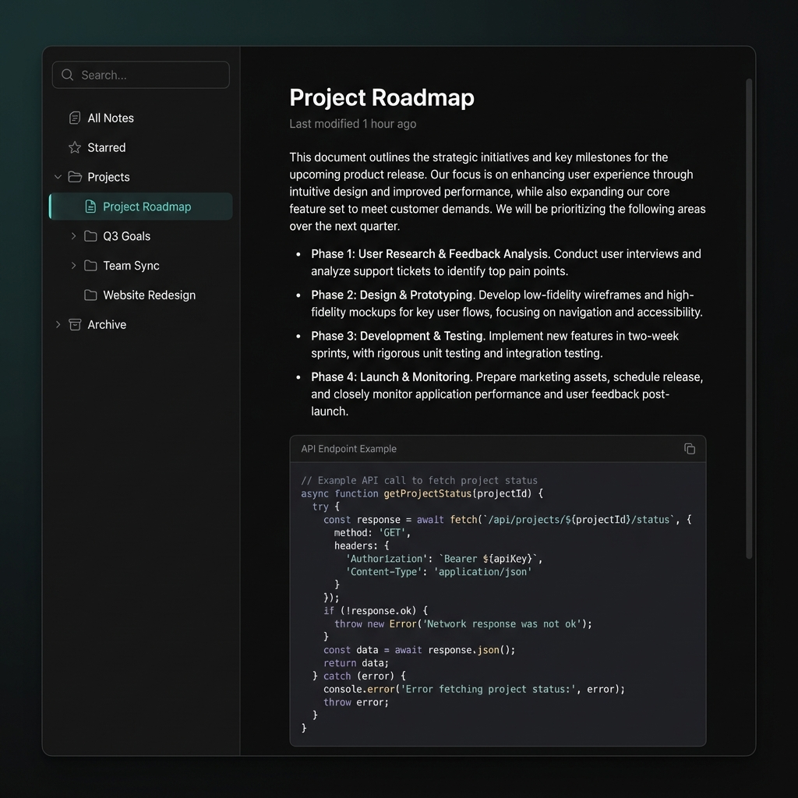

<p align="center">
  
</p>

<h1 align="center">Skriuw</h1>
<p align="center"><em>/skriːu/ — Dutch for "write"</em></p>

<p align="center">
  <a href="https://github.com/remcostoeten/skriuw/releases"></a>
  <a href="LICENSE"></a>
  <a href="https://skriuw.vercel.app"></a>
  <a href="https://github.com/remcostoeten/skriuw/releases"></a>
</p>

---

<p align="center">
  
</p>

---

A note-taking and productivity application that respects your choices. Cloud-hosted, self-hosted, or fully offline — you decide how your data lives.

Built for people who want a beautiful writing experience without being forced into a specific workflow or pricing model.

---

## What Makes Skriuw Different

Most note apps make decisions for you. Skriuw asks what you want.

| | Skriuw | Notion | Obsidian | Apple Notes |
|---|:---:|:---:|:---:|:---:|
| **Opt-in features** (nothing forced) | Yes | No | Partial | No |
| **Cloud, self-host, or offline** | All three | Cloud only | Local only | iCloud only |
| **Desktop apps** (native, not Electron) | Tauri | Electron | Electron | Native |
| **Bring your own database** | PostgreSQL, SQLite, or filesystem | No | Filesystem | No |
| **Bring your own AI** | OpenAI, Anthropic, Ollama, or none | GPT-4 only | Via plugins | Apple Intelligence |
| **Block-based editor** | Yes | Yes | No | No |
| **Wikilinks and backlinks** | Yes | Partial | Yes | No |
| **Tags with nesting** | Yes | Yes | Yes | Yes |
| **Folders and hierarchy** | Yes | Yes | Yes | Yes |
| **Global command palette** | Yes | Yes | Yes | No |
| **Offline PWA support** | Yes | No | N/A | N/A |
| **Open source** | MIT | No | Partial | No |

---

## Features

**Editor**
- Block-based rich text editor with slash commands
- Wikilinks (`[[Note Name]]`) with automatic backlinking
- Tag mentions with `#tag` syntax and filtering
- Code blocks with syntax highlighting
- Tables, callouts, and embeds
- Cover images and icons per note
- Full-text search across all content

**Organization**
- Nested folders with drag-and-drop
- Pin and favorite notes
- Archive and trash with recovery
- Quick capture from anywhere
- Journal templates with daily notes

**Deployment Options**
- **Cloud**: Sign up at [skriuw.vercel.app](https://skriuw.vercel.app) and start writing
- **Self-hosted**: Deploy to your own Vercel, Railway, or VPS with PostgreSQL
- **Desktop**: Native apps for macOS, Windows, and Linux via Tauri
- **Fully private**: Desktop build with local SQLite or filesystem storage — no server required

**Bring Your Own Keys (BYOK)**
- AI providers: OpenAI, Anthropic, Groq, or local models via Ollama
- Database: PostgreSQL (cloud), SQLite (desktop), or raw filesystem
- Storage: Vercel Blob, S3-compatible, or local disk

---

## Installation

### Web (Instant)

Visit **[skriuw.vercel.app](https://skriuw.vercel.app)** — works offline as a PWA.

### Desktop Downloads

Download the latest release for your platform:

| Platform | Download |
|----------|----------|
| **macOS** (Apple Silicon) | [skriuw-x.x.x-aarch64.dmg](https://github.com/remcostoeten/skriuw/releases) |
| **macOS** (Intel) | [skriuw-x.x.x-x64.dmg](https://github.com/remcostoeten/skriuw/releases) |
| **Windows** | [skriuw-x.x.x-x64-setup.exe](https://github.com/remcostoeten/skriuw/releases) |
| **Linux** (AppImage) | [skriuw-x.x.x-x86_64.AppImage](https://github.com/remcostoeten/skriuw/releases) |
| **Linux** (deb) | [skriuw_x.x.x_amd64.deb](https://github.com/remcostoeten/skriuw/releases) |
| **Linux** (rpm) | [skriuw-x.x.x-1.x86_64.rpm](https://github.com/remcostoeten/skriuw/releases) |

### Package Managers

```bash
# macOS (Homebrew)
brew tap remcostoeten/skriuw
brew install skriuw

# Arch Linux (AUR)
yay -S skriuw-bin

# Ubuntu/Debian
sudo add-apt-repository ppa:remcostoeten/skriuw
sudo apt update && sudo apt install skriuw

# Fedora/RHEL
sudo dnf copr enable remcostoeten/skriuw
sudo dnf install skriuw

# Snap
sudo snap install skriuw

# Flatpak
flatpak install flathub app.skriuw.Skriuw

# Direct download via wget
wget https://github.com/remcostoeten/skriuw/releases/latest/download/skriuw-linux-x86_64.AppImage
chmod +x skriuw-linux-x86_64.AppImage
./skriuw-linux-x86_64.AppImage
```

### Self-Hosting

```bash
git clone https://github.com/remcostoeten/skriuw.git
cd skriuw

# Copy environment template
cp .env.example .env.local

# Configure your database and auth providers in .env.local

# Install and run
bun install
bun run build
bun run start
```

Deployment guides available for Vercel, Railway, Fly.io, and Docker.

---

## Development

```bash
git clone https://github.com/remcostoeten/skriuw.git
cd skriuw
bun install
bun run dev
```

The monorepo contains:
- `apps/web` — Next.js web application
- `apps/web/src-tauri` — Tauri desktop wrapper
- `packages/db` — Database schema (Drizzle ORM)
- `packages/ui` — Shared component library
- `packages/shared` — Utilities and types

---

MIT

xxx,  
[Remco Stoeten](https://remcostoeten-nl.vercel.app)
