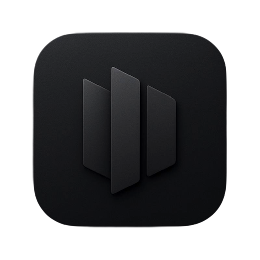
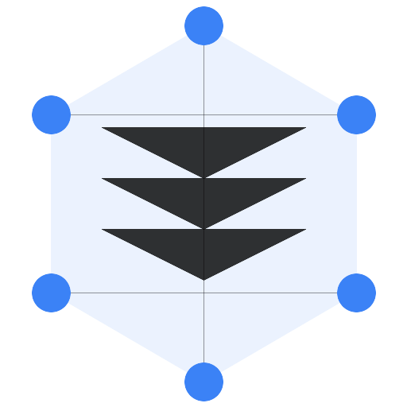

[](https://github.com/remcostoeten/skriuw/releases)
[](LICENSE)
[](https://github.com/remcostoeten/skriuw)
[](https://skriuw.vercel.app)
[](package.json)
[](package.json)

# Skriuw

Lightning-fast note and task manager for desktop and web. A cross-platform productivity application with local-first architecture.

## Features

- Local-first architecture - your data stays on your device
- Cross-platform support - Web, Linux, macOS, and Windows
- Markdown editor with real-time preview
- Task management integrated with note-taking
- Offline support with cloud sync options
- Privacy-focused and secure by default
- Fast and responsive interface

## Installation

### Web

Visit [skriuw.vercel.app](https://skriuw.vercel.app)

### Desktop

Download the latest release for your operating system from the [releases page](https://github.com/remcostoeten/skriuw/releases)

## Quick Start

```bash
# Clone the repository
git clone https://github.com/remcostoeten/skriuw.git
cd skriuw

# Install dependencies
bun install

# Start development server
bun run dev
```

## Development

This project uses a monorepo setup with Bun workspaces.

### Structure

```
skriuw/
├── apps/
│   ├── desktop/           # Tauri desktop application
│   └── web/               # Next.js web application
├── packages/
│   ├── db/                # Database schema and utilities
│   ├── ui/                # Shared UI components
│   └── shared/            # Shared utilities and types
└── scripts/               # Development and build scripts
```

### Available Scripts

- `bun run dev` - Start development server
- `bun run build` - Build for production
- `bun run lint` - Run linter
- `bun run test` - Run tests
- `bun run format` - Format code with Prettier

## Preview



To capture a programmatic screenshot of the application:

```bash
# Start the development server
bun run dev

# Use a tool like Puppeteer or Playwright to capture screenshots
# This can be automated in CI/CD pipelines
```

## Use Cases

- Personal note-taking and documentation
- Task and project management
- Knowledge base and research organization
- Daily journaling and planning
- Secure personal information storage

## Tech Stack

- Frontend: React, Next.js, Tauri 2.0
- Database: PostgreSQL with Drizzle ORM
- UI: Custom component library
- Authentication: Better Auth
- Package Manager: Bun
- Build Tool: Turborepo

## Contributing

Contributions are welcome. Please read our contributing guidelines before submitting pull requests.

## License

MIT License - see LICENSE file for details

## Links

- Homepage: [skriuw.vercel.app](https://skriuw.vercel.app)
- Repository: [github.com/remcostoeten/skriuw](https://github.com/remcostoeten/skriuw)
- Issues: [github.com/remcostoeten/skriuw/issues](https://github.com/remcostoeten/skriuw/issues)
