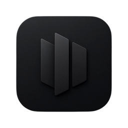

<p align="center">
  
</p>

<p align="center">
  <strong>Skriuw</strong> <em>(noun)</em><br />
  /skrɪu̯/, <em>Frisian, “to write.”</em>
</p>

<p align="center">
  <a href="https://github.com/remcostoeten/skriuw/releases"></a>
  
  
  
  
  
</p>

<p align="center">
  <b>A local-first desktop app for notes, journaling, and knowledge work.</b>
</p>

<p align="center">
  Fast, private, and fully local: Skriuw v2 keeps your workspace in SQLite on your own machine, with portable archives and Git-backed history.
</p>

<p align="center">
  
</p>

## Skriuw v2 — current desktop release

**v2 is the current, fully released desktop line.** It is a local-first rebuild focused on immediate interaction: every navigation and edit action is designed to give same-frame feedback, with no sync dialogs or loading states.

- macOS, Windows, and Linux installers are published on the [latest release](https://github.com/remcostoeten/skriuw/releases/latest).
- v2 is available from the apt and dnf repositories, Homebrew tap, Scoop bucket, and AUR. See [v2 installation instructions](v2/README.md#installation).
- Winget and the Snap Store do **not** yet carry the current v2 release. Use the release assets or another listed channel until they do.

v2 is desktop-only and local-first: it has no cloud sync or mobile client. Read [v2's feature list](v2/FEATURES.md) and [architecture](v2/ARCHITECTURE.md) for its current scope.

## Choose the right line

This repository carries two independent Skriuw lines. Their data models, product scope, and release tags differ; install the line that matches your needs.

| Line                             | Use it when                                                                               | Install / run it                                                                               |
| -------------------------------- | ----------------------------------------------------------------------------------------- | ---------------------------------------------------------------------------------------------- |
| **v2 (current desktop release)** | You want the fast, private, local-first desktop application.                              | [v2 install guide](v2/README.md#installation) · releases tagged `v2-v*`                        |
| **v1 (legacy, broader product)** | You need the web app, mobile app, cloud sync, sharing, or the established v1 feature set. | [v1 guide below](#v1-legacy-web-mobile-and-self-hosted) · desktop releases tagged `desktop-v*` |

**Versioning:** v2 releases use `v2-v*` tags and are promoted to GitHub’s **Latest** release. v1’s historical desktop releases use `desktop-v*`; its web/mobile code remains under `apps/` and `packages/`.

## v1 — legacy web, mobile, and self-hosted

v1 remains available for users who need its broader cloud-enabled product. It is not the current desktop release; do not use unversioned package-manager commands to seek a v1 installer, because those channels track v2.

For the hosted v1 app, visit [skriuw.com](https://skriuw.com). To self-host it, follow the Docker instructions below. To use a historical v1 desktop build, select the appropriate `desktop-v*` release from [all releases](https://github.com/remcostoeten/skriuw/releases) and download its matching asset.

### A place to think in public or in private

### Keep the whole thread

| Area           | What it gives you                                                                                   |
| -------------- | --------------------------------------------------------------------------------------------------- |
| Notes          | Rich text and Markdown modes, wiki-style note links, backlinks, tags, folders, and version history. |
| Journal        | Calendar-based daily entries with moods, tags, autosave, and quick navigation.                      |
| Knowledge base | Wikilinks and backlinks connect notes into a browsable, searchable graph.                           |
| Sharing        | Frozen note snapshots with optional passwords, expiry, and view-once access.                        |
| AI (BYOK)      | Title generation, spell check, and continue-writing actions with your own API key.                  |
| Planning       | A public roadmap board for features, issues, and upcoming work.                                     |
| Control        | Export, import, account deletion, themes, typography, and editor preferences.                       |

### See the workspace

<table>
  <tr>
    <td width="50%">
      
    </td>
    <td width="50%">
      
    </td>
  </tr>
  <tr>
    <td colspan="2">
      
    </td>
  </tr>
</table>

### Stay with the thought

- Move through the app from the keyboard, with a command palette and quick search close at hand
- Switch between rich text and Markdown without leaving the same workspace
- Keep the interface out of the way, so the writing surface has room to breathe
- Read and work from a local cache, with AI private by default

### Your words, your terms

- Your notes and journal entries live in your own database-backed account
- Shared notes are frozen snapshots, not live views of the source document
- AI provider keys are encrypted at rest when stored in the app
- You can export your workspace and delete your account from inside the app

### Bring your library with you

Skriuw uses a portable ZIP backup format for your workspace:

- Export from **Settings → Data & sync** downloads `skriuw-export-YYYY-MM-DD.zip`
- Import supports **merge** (skip duplicates), **overwrite** (update matches), or **replace workspace**

Third-party imports (best effort, structure and formatting may need cleanup):

| Source           | What to upload                    | Notes                                                               |
| ---------------- | --------------------------------- | ------------------------------------------------------------------- |
| Obsidian         | Vault ZIP                         | Wikilinks converted to Markdown links; `.obsidian` metadata skipped |
| Apple Notes      | HTML export ZIP                   | Plain text and Markdown body; attachments not included              |
| Bear             | Markdown export ZIP               | Header `#tags` mapped to note tags                                  |
| Notion           | Markdown export ZIP               | Databases, CSVs, and attachments skipped                            |
| Simplenote       | Export ZIP                        | Titles derived from first line; trashed notes land in Trash         |
| Desktop snapshot | Snapshot ZIP from the desktop app | Notes, folders, journal entries, and journal tags                   |
| Markdown folder  | Any folder ZIP                    | Generic path-based import when auto-detect is unsure                |

Use **Auto-detect** in Settings when you are not sure which profile fits.

Archive layout:

```text
skriuw-export-YYYY-MM-DD/
├── skriuw-export.json
├── notes/
│   ├── [folders/]note-name.md
│   └── [folders/]note-name.rich.json
├── journal/
│   └── YYYY-MM-DD.md
└── versions/
    └── {noteId}/{versionId}.json
```

### Built to last

Next.js, Expo/React Native, PostgreSQL with Prisma, Better Auth, Tauri for the
desktop build, and a block-based editor with real-time collaboration. Managed
with Bun 1.3.14 in a monorepo.

### Choose where v1 lives

Whether you want the convenience of the web app, a private server, or a folder of plain Markdown files on your own machine, there is a version of Skriuw for that.

| Mode                                   | Storage                                  | How you get it                         | Best for                                              |
| -------------------------------------- | ---------------------------------------- | -------------------------------------- | ----------------------------------------------------- |
| **Cloud**                              | Postgres (hosted)                        | Visit [skriuw.com](https://skriuw.com) | Just want to write, nothing to install                |
| **Mobile**                             | Cloud account + offline read cache       | Expo development build                 | Notes and journal across phone and web                |
| **Self-host (Docker)**                 | Postgres                                 | `docker pull` + Compose (below)        | A server / homelab instance you own, multi-device     |
| **Desktop**                            | Markdown vault + SQLite (local, offline) | Native installer                       | Local-first, no server, no account                    |
| _Self-host local-first vault (Docker)_ | Markdown vault + SQLite                  | _coming soon_                          | Homelab users who want plain `.md` files, no Postgres |

### Self-host with Docker

Docker is the **v1** self-hosted web application, not the v2 local-first desktop app. The published multi-architecture image is available for `linux/amd64` and `linux/arm64`:

```bash
docker pull ghcr.io/remcostoeten/skriuw:latest
```

It needs PostgreSQL plus the required application secrets, so use Compose for a working setup. No repo clone is needed, just two files:

```bash
# 1. Grab the compose file and env template
curl -O https://raw.githubusercontent.com/remcostoeten/skriuw/daddy/docker-compose.yml
curl -o .env https://raw.githubusercontent.com/remcostoeten/skriuw/daddy/.env.example

# 2. Set the two required secrets in .env
#    BETTER_AUTH_SECRET and AI_KEYS_ENCRYPTION_SECRET
#    (each: openssl rand -base64 32). Leave the rest at their defaults.

# 3. Start: pulls ghcr.io/remcostoeten/skriuw + postgres:17, runs migrations
docker compose up -d
```

Open `http://localhost:3000`. Data persists in the `skriuw-db` volume. The entrypoint fails fast with a clear message if a required secret is missing or still a placeholder.

**Bring your own Postgres** (Neon, RDS, an existing box): drop the `db` service and point `DATABASE_URL` at it.

**Custom domain:** `NEXT_PUBLIC_*` values (auth URL, etc.) are baked into the image at build time, so the published image only works cleanly on `http://localhost:3000`. To serve a custom domain, build from source with your own values:

```bash
git clone https://github.com/remcostoeten/skriuw && cd skriuw
# set BETTER_AUTH_URL + NEXT_PUBLIC_BETTER_AUTH_URL in .env, then:
docker compose -f docker-compose.build.yml up --build -d
```

> Realtime collaboration is a Cloudflare Worker (`party/`) and is **not** part of the Docker stack. It stays disabled unless you deploy that worker and set `NEXT_PUBLIC_PARTYKIT_HOST`. Everything else works without it.

### Historical v1 desktop builds

Historical v1 installers are preserved on [`desktop-v*` releases](https://github.com/remcostoeten/skriuw/releases?q=desktop-v&expanded=true). Download the matching macOS, Windows, `.deb`, `.rpm`, or AppImage asset from the release you need. The active apt/dnf, Homebrew, Scoop, and AUR channels install **v2**, not v1.

### Work on v1

Copy `.env.example` to `.env.local`, set `DATABASE_URL`, `BETTER_AUTH_SECRET`, `BETTER_AUTH_URL`, and `NEXT_PUBLIC_BETTER_AUTH_URL`, then install and start the app:

```bash
bun install
bun dev
```

Run the mobile app with a development client:

```bash
bun mobile
bun mobile:check
```

## License

See [LICENSE](LICENSE).
