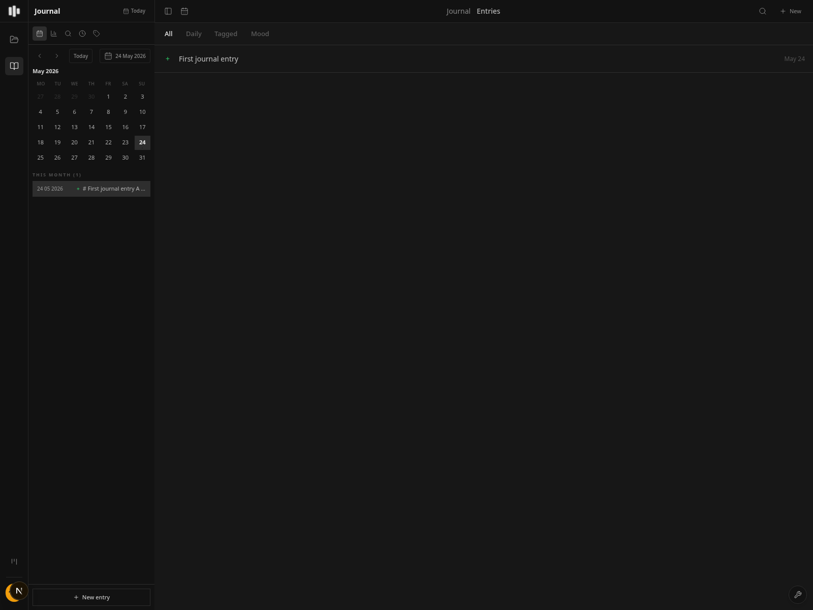
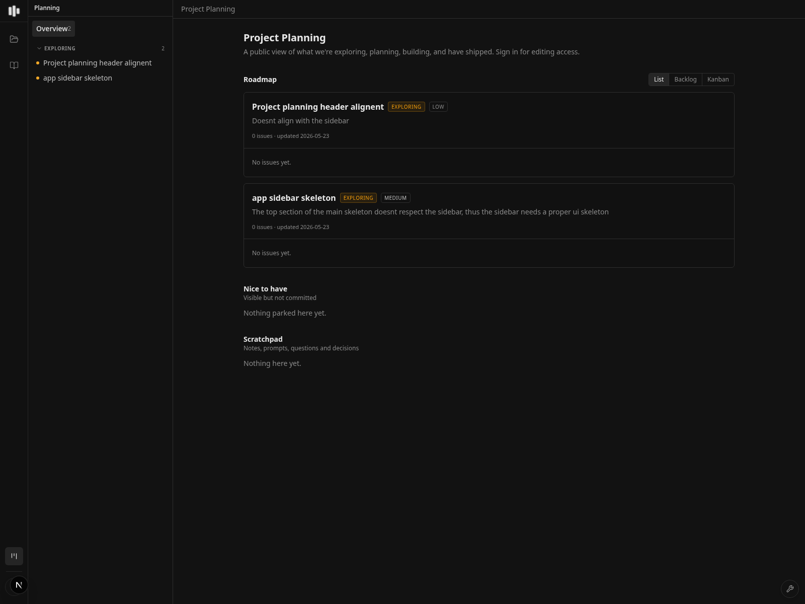

<p align="center">
  
</p>

<h1 align="center">Skriuw</h1>

<p align="center">
  <em>Frisian for “to write.”</em>
</p>

<p align="center">
  A quiet writing workspace for notes, journaling, sharing, and planning.
</p>

<p align="center">
  
</p>

## What It Is

Skriuw keeps writing, daily notes, and lightweight roadmap tracking in one place. It is built for people who want a calm interface, fast keyboard-driven navigation, and a plain path for thinking and drafting without friction.

> [!NOTE]
> AI is optional. You can bring your own provider key, or use the app's fallback keys. User keys are encrypted at rest.

## At A Glance

| Area | What it gives you |
| --- | --- |
| Notes | Rich text and plain text modes, wiki-style note links, backlinks, tags, folders, and version history. |
| Journal | Calendar-based daily entries with moods, tags, autosave, and quick navigation. |
| Sharing | Frozen note snapshots with optional passwords, expiry, and view-once access. |
| AI | Title generation, spell check, and continue-writing actions. |
| Planning | A public roadmap board for features, issues, and upcoming work. |
| Control | Export, import, account deletion, themes, typography, and editor preferences. |

## Real Screens

<table>
  <tr>
    <td width="50%">
      
    </td>
    <td width="50%">
      
    </td>
  </tr>
  <tr>
    <td colspan="2">
      
    </td>
  </tr>
</table>

## Why It Feels Fast

- Keyboard-first navigation
- Command palette and quick search
- Rich and plain editor modes in the same workspace
- Minimal chrome around the writing surface
- Private-by-default AI and account-backed data

## Privacy and Control

- Your notes and journal entries live in your own database-backed account
- Shared notes are frozen snapshots, not live views of the source document
- AI provider keys are encrypted at rest when stored in the app
- You can export your workspace and delete your account from inside the app

## Backup and import

Skriuw uses a portable ZIP backup format for your workspace:

- Export from **Settings → Data & sync** downloads `skriuw-export-YYYY-MM-DD.zip` (v3)
- v3 adds SHA-256 checksums, optional note version history, and import policies
- Import supports **merge** (skip duplicates), **overwrite** (update matches), or **replace workspace**
- Import a **Markdown folder ZIP** (Obsidian vaults, Apple Notes shortcuts, plain folders)
- Legacy v1/v2 Skriuw exports still import

Archive layout:

```text
skriuw-export-YYYY-MM-DD/
├── skriuw-export.json
├── notes/
│   ├── [folders/]note-name.md
│   └── [folders/]note-name.rich.json
├── journal/
│   └── YYYY-MM-DD.md
└── versions/
    └── {noteId}/{versionId}.json
```

## Run Locally

Copy `.env.example` to `.env.local`, set `DATABASE_URL`, `BETTER_AUTH_SECRET`, `BETTER_AUTH_URL`, and `NEXT_PUBLIC_BETTER_AUTH_URL`, then install and start the app:

```bash
bun install
bun dev
```
