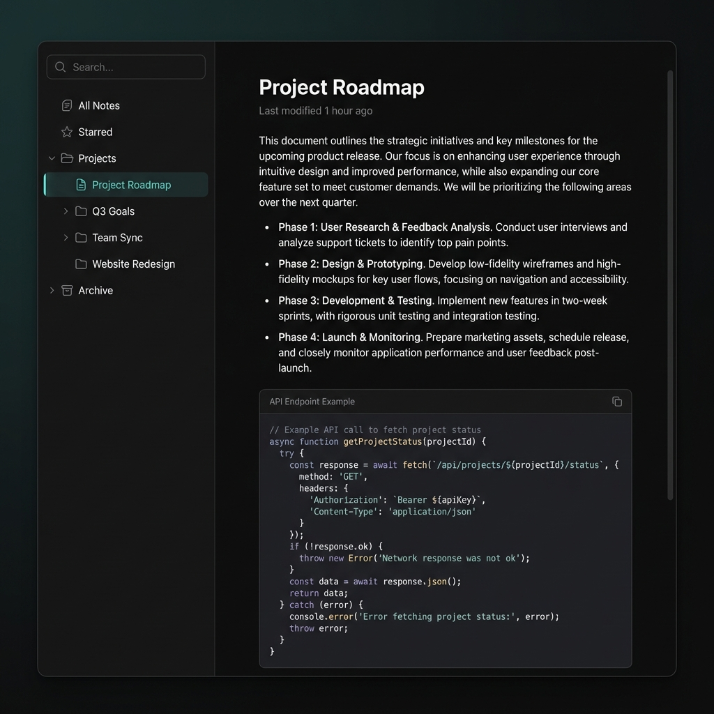

<p align="center">
  
</p>

<h1 align="center">Skriuw</h1>

<p align="center">
  <em>Frisian, "to write."</em>
</p>

<p align="center">
  A calm, keyboard-first notes and journal workspace with account-backed sync, rich editing, backlinks, version history, and bring-your-own-key AI.
</p>

<p align="center">
  <a href="https://skriuw.app"></a>
  
  
  
  
  
</p>

<p align="center">
  <a href="#features">Features</a> ·
  <a href="#getting-started">Getting Started</a> ·
  <a href="#configuration">Configuration</a> ·
  <a href="#project-structure">Project Structure</a> ·
  <a href="#scripts">Scripts</a>
</p>

<p align="center">
  
</p>

## Overview

Skriuw combines long-form notes, daily journaling, and lightweight project planning in a single writing-focused workspace. It is built for fast keyboard navigation, low-friction organization, and private-by-default AI workflows where users bring their own provider keys.

The app is a Next.js App Router project backed by Supabase Auth and Postgres. Client state is kept responsive with Zustand and TanStack Query, while server actions own persistence, exports, account deletion, and AI provider access.

> [!NOTE]
> AI features are opt-in. Provider keys are stored per account and can be encrypted with `AI_KEYS_ENCRYPTION_SECRET`.

## Features

| Area | What Skriuw does |
| --- | --- |
| Notes | Rich BlockNote editor, raw markdown mode, slash commands, checklists, code blocks, file-tree blocks, and per-note editor mode preferences. |
| Linking | Wiki-style `[[Note Title]]` links, inline note chips, unresolved-link creation, backlinks, and inline `#tag` extraction. |
| Organization | Nested folders, favorites, recents, configurable sidebar sections, compact mode, and soft deletion. |
| Journal | Calendar-based daily entries with mood tracking, color-coded tags, autosave, word counts, streaks, mood distribution, and activity heatmaps. |
| Versioning | Automatic note checkpoints with content hashing, meaningful-change thresholds, side-by-side previews, and one-click restore. |
| AI | Bring-your-own-key actions for title generation, spell check, and continuing text with Google Gemini and Groq models. |
| Settings | Theme, accent, editor typography, line height, markdown behavior, AI keys, export, and account controls. |
| Planning | Public `/project-planning` roadmap with feature states, issues, custom sections, admin-only editing, and atomic moves. |

## Tech Stack

- **Framework:** Next.js 16, React 19, TypeScript
- **Styling:** Tailwind CSS v4, Radix UI primitives, custom theme tokens
- **Editor:** BlockNote, Shiki, custom inline/block specs
- **Data:** Supabase Auth, Supabase Postgres, Row Level Security
- **State:** TanStack Query, Zustand
- **AI:** Vercel AI SDK v6, Google Gemini, Groq
- **Testing:** Bun test, Playwright, `@next/playwright`
- **Tooling:** Bun, oxlint, oxfmt

## Getting Started

### Prerequisites

- [Bun](https://bun.sh)
- A Supabase project with Email/Password auth enabled
- Optional OAuth providers: Google and GitHub

### Run Locally

```bash
bun install
```

Create `.env.local`:

```bash
NEXT_PUBLIC_SUPABASE_URL="https://your-project.supabase.co"
NEXT_PUBLIC_SUPABASE_PUBLISHABLE_KEY="your-supabase-publishable-key"
SUPABASE_SERVICE_ROLE_KEY="your-service-role-key"
AI_KEYS_ENCRYPTION_SECRET="your-ai-provider-key-encryption-secret"
```

Start the development server:

```bash
bun dev
```

Open [http://localhost:3000](http://localhost:3000).

> [!IMPORTANT]
> `SUPABASE_SERVICE_ROLE_KEY` is server-only. Do not expose it to the browser or commit real secrets.

## Configuration

### Supabase

Skriuw expects user-scoped tables protected by RLS. The core app uses:

- `folders`
- `notes`
- `note_versions`
- `journal_entries`
- `tags`
- `user_recents`
- `ai_provider_keys`
- `ai_usage_logs`
- `ai_error_events`

The public planning board uses:

- `user_roles`
- `features`
- `issues`
- `nice_to_haves`
- `scratch_entries`
- `planning_sections`
- `planning_section_items`

Migration SQL lives in [`supabase/migrations`](supabase/migrations). Apply the migrations to your Supabase project, then configure Auth redirect URLs for local and production environments.

### Admin Access

Project planning writes are admin-only. Use [`scripts/set-admin.sql`](scripts/set-admin.sql) as the starting point for assigning an admin role in Supabase.

## Project Structure

```text
src/
├── app/          # App Router routes, layouts, API handlers, loading states
├── core/         # Supabase clients, persistence bootstrap, shortcut runtime
├── domain/       # Server-side models, mappers, persistence APIs, seed data
├── features/     # Product modules: notes, editor, journal, settings, AI, planning
├── platform/     # Auth integration and platform-specific adapters
├── providers/    # App-level providers and protected workspace bootstrapping
├── shared/       # Reusable UI primitives, icons, hooks, and utilities
└── types/        # Shared legacy types kept during migration
```

## Scripts

| Command | Description |
| --- | --- |
| `bun dev` | Start Next.js with Turbopack. |
| `bun build` | Create a production build. |
| `bun run build:verified` | Run the verified build helper. |
| `bun start` | Serve the production build. |
| `bun test` | Run the unit test suite. |
| `bun run test:smoke` | Build and run Playwright smoke tests. |
| `bun run test:skeleton` | Build and run skeleton/loading-state QA. |
| `bun run lint` | Run oxlint. |
| `bun run format` | Run oxfmt. |
| `bun run colors:audit` | Report hardcoded color values. |
| `bun run colors:audit:strict` | Enforce the color audit. |

## Data Export

Authenticated users can export their workspace as a ZIP from the app. The export contains markdown notes, journal entries with frontmatter, and a small `skriuw-export.json` manifest for future import tooling.

## Development Notes

- Server actions in `src/domain/**/api.ts` are the primary persistence boundary.
- Supabase clients are split between browser, server, and admin usage in `src/core/supabase`.
- Notes are soft-deleted with `deleted_at`; exports and list queries only include active records.
- Version history is persisted only when content changes are meaningful enough to avoid noisy checkpoints.
- Route loading shells and skeleton QA live alongside the App Router pages and Playwright smoke tests.
