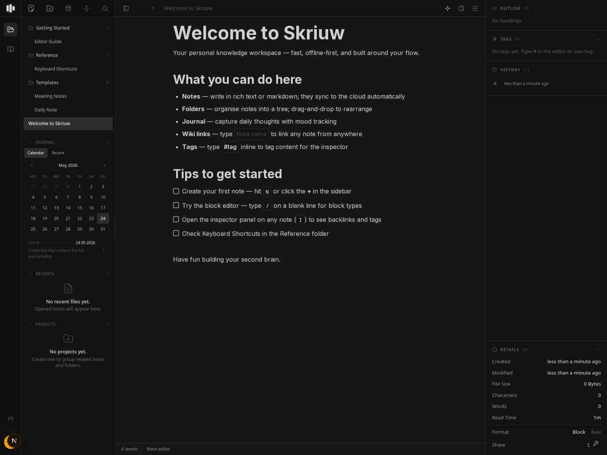

<p align="center">
  
</p>

<h1 align="center">Skriuw</h1>

<p align="center">
  <b>Open source note-taking, journaling, and knowledge base for web and desktop.</b>
</p>

<p align="center">
  Markdown notes, wiki-style links, backlinks, tags, daily journaling, and optional bring-your-own-key AI. A calm, fast, keyboard-driven Notion and Obsidian alternative built with Next.js, PostgreSQL, and Tauri.
</p>

<p align="center">
  <i>Skriuw is Frisian for "to write."</i>
</p>

<p align="center">
  
</p>

## What is Skriuw

Skriuw is a privacy-first writing app that keeps your notes, daily journal, and lightweight roadmap planning in one workspace. It is built for people who want a quiet interface, fast keyboard-driven navigation, and a plain path for thinking and drafting without friction.

Everything is minimal by default and feature-rich when you opt in. It runs in the browser and as a native desktop app, and you can self-host it.

> [!NOTE]
> AI is optional. Bring your own provider key or use the app's fallback keys. User keys are encrypted at rest.

## Features

| Area           | What it gives you                                                                                   |
| -------------- | --------------------------------------------------------------------------------------------------- |
| Notes          | Rich text and Markdown modes, wiki-style note links, backlinks, tags, folders, and version history. |
| Journal        | Calendar-based daily entries with moods, tags, autosave, and quick navigation.                      |
| Knowledge base | Wikilinks and backlinks connect notes into a browsable, searchable graph.                           |
| Sharing        | Frozen note snapshots with optional passwords, expiry, and view-once access.                        |
| AI (BYOK)      | Title generation, spell check, and continue-writing actions with your own API key.                  |
| Planning       | A public roadmap board for features, issues, and upcoming work.                                     |
| Control        | Export, import, account deletion, themes, typography, and editor preferences.                       |

## Screenshots

<table>
  <tr>
    <td width="50%">
      
    </td>
    <td width="50%">
      
    </td>
  </tr>
  <tr>
    <td colspan="2">
      
    </td>
  </tr>
</table>

## Why it feels fast

- Keyboard-first navigation
- Command palette and quick search
- Rich and Markdown editor modes in the same workspace
- Minimal chrome around the writing surface
- Local-first caching and private-by-default AI

## Privacy and control

- Your notes and journal entries live in your own database-backed account
- Shared notes are frozen snapshots, not live views of the source document
- AI provider keys are encrypted at rest when stored in the app
- You can export your workspace and delete your account from inside the app

## Backup and import

Skriuw uses a portable ZIP backup format for your workspace:

- Export from **Settings → Data & sync** downloads `skriuw-export-YYYY-MM-DD.zip` (v3)
- v3 adds SHA-256 checksums, optional note version history, and import policies
- Import supports **merge** (skip duplicates), **overwrite** (update matches), or **replace workspace**
- Legacy v1 and v2 Skriuw exports still import

Third-party imports (best effort, structure and formatting may need cleanup):

| Source          | What to upload      | Notes                                                               |
| --------------- | ------------------- | ------------------------------------------------------------------- |
| Obsidian        | Vault ZIP           | Wikilinks converted to Markdown links; `.obsidian` metadata skipped |
| Apple Notes     | HTML export ZIP     | Plain text and Markdown body; attachments not included              |
| Bear            | Markdown export ZIP | Header `#tags` mapped to note tags                                  |
| Notion          | Markdown export ZIP | Databases, CSVs, and attachments skipped                            |
| Markdown folder | Any folder ZIP      | Generic path-based import when auto-detect is unsure                |

Use **Auto-detect** in Settings when you are not sure which profile fits.

Archive layout:

```text
skriuw-export-YYYY-MM-DD/
├── skriuw-export.json
├── notes/
│   ├── [folders/]note-name.md
│   └── [folders/]note-name.rich.json
├── journal/
│   └── YYYY-MM-DD.md
└── versions/
    └── {noteId}/{versionId}.json
```

## Tech stack

Next.js, PostgreSQL with Prisma, Better Auth, Tauri for the desktop build, and a block-based editor with real-time collaboration. Managed with Bun in a monorepo.

## Install — pick how you run it

Skriuw ships in a few shapes. Pick whichever fits; they all run the same app.

| Mode                                   | Storage                                  | How you get it                         | Best for                                              |
| -------------------------------------- | ---------------------------------------- | -------------------------------------- | ----------------------------------------------------- |
| **Cloud**                              | Postgres (hosted)                        | Visit [skriuw.com](https://skriuw.com) | Just want to write, nothing to install                |
| **Self-host (Docker)**                 | Postgres                                 | `docker pull` + Compose (below)        | A server / homelab instance you own, multi-device     |
| **Desktop**                            | Markdown vault + SQLite (local, offline) | Native installer                       | Local-first, no server, no account                    |
| _Self-host local-first vault (Docker)_ | Markdown vault + SQLite                  | _coming soon_                          | Homelab users who want plain `.md` files, no Postgres |

### Self-host with Docker

Runs the web app plus a Postgres container. No repo clone needed — just two files:

```bash
# 1. Grab the compose file and env template
curl -O https://raw.githubusercontent.com/remcostoeten/skriuw/daddy/docker-compose.yml
curl -o .env https://raw.githubusercontent.com/remcostoeten/skriuw/daddy/.env.example

# 2. Set the two required secrets in .env
#    BETTER_AUTH_SECRET and AI_KEYS_ENCRYPTION_SECRET
#    (each: openssl rand -base64 32). Leave the rest at their defaults.

# 3. Start — pulls ghcr.io/remcostoeten/skriuw + postgres:17, runs migrations
docker compose up -d
```

Open `http://localhost:3000`. Data persists in the `skriuw-db` volume. The entrypoint fails fast with a clear message if a required secret is missing or still a placeholder.

**Bring your own Postgres** (Neon, RDS, an existing box): drop the `db` service and point `DATABASE_URL` at it.

**Custom domain:** `NEXT_PUBLIC_*` values (auth URL, etc.) are baked into the image at build time, so the published image only works cleanly on `http://localhost:3000`. To serve a custom domain, build from source with your own values:

```bash
git clone https://github.com/remcostoeten/skriuw && cd skriuw
# set BETTER_AUTH_URL + NEXT_PUBLIC_BETTER_AUTH_URL in .env, then:
docker compose -f docker-compose.build.yml up --build -d
```

> Realtime collaboration is a Cloudflare Worker (`party/`) and is **not** part of the Docker stack — it stays disabled unless you deploy that worker and set `NEXT_PUBLIC_PARTYKIT_HOST`. Everything else works without it.

### Desktop

Native app (Tauri) with fully local, offline storage — your notes are plain Markdown files plus a SQLite index, no server or account. Download from [Releases](https://github.com/remcostoeten/skriuw/releases), or:

```bash
# macOS (Homebrew) — tap by URL, then install the cask
brew tap remcostoeten/skriuw https://github.com/remcostoeten/skriuw && brew install --cask skriuw

winget install RemcoStoeten.Skriuw   # Windows
yay -S skriuw-bin                    # Arch (AUR)
sudo dpkg -i skriuw_*.deb            # Debian/Ubuntu (from Releases)
```

## Run locally (development)

Copy `.env.example` to `.env.local`, set `DATABASE_URL`, `BETTER_AUTH_SECRET`, `BETTER_AUTH_URL`, and `NEXT_PUBLIC_BETTER_AUTH_URL`, then install and start the app:

```bash
bun install
bun dev
```

## License

See [LICENSE](LICENSE).
