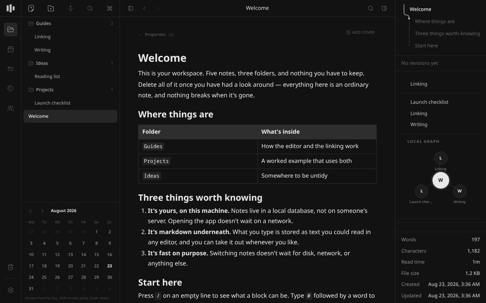

<p align="center">
  
</p>

<h1 align="center">Skriuw</h1>

<p align="center">
  <em><strong>skriuw</strong> · verb · Frisian<br />
  "to write"</em>
</p>

<p align="center">
  A blazingly fast, private writing workspace for notes, journals, and connected knowledge.<br />
  Desktop-first on macOS, Windows, and Linux, with a Rust core and SQLite on disk.<br />
  It runs in the browser too, on the same engine compiled to WebAssembly, storing notes locally.<br />
  Sign in and your workspace syncs, so you can pick up on the web where your desktop left off.
</p>

<p align="center">
  <a href="https://github.com/remcostoeten/skriuw/releases/latest"></a>
  <a href="https://github.com/remcostoeten/skriuw/actions/workflows/ci-v2.yml"></a>
  <a href="LICENSE"></a>
  <a href="https://github.com/remcostoeten/skriuw/releases"></a>
</p>

<p align="center">
  
</p>
<p align="center">
  <sub>The browser build at <a href="https://skriuw.com/app">skriuw.com/app</a>, driven from the keyboard, captured in real time and uncut. The desktop app is the same renderer on the same Rust core.</sub>
</p>

Your workspace is a SQLite database on your machine. Open the app, type, and
every keystroke paints in the same frame: no spinners, no server round-trips,
no account. Try it without installing anything: the **full app runs in your
browser** at [skriuw.com/app](https://skriuw.com/app).

- A real rich-text editor that speaks Markdown
- `#` tags, `$` people, and `@` note links; renames propagate, backlinks everywhere
- Automatic Git history and verified backups, in the background
- Imports from Obsidian, Notion, Bear, Apple Notes, and plain Markdown
- Keyboard-first, fast at thousands of notes, sync strictly opt-in
- Nine themes (Skriuw, Paper, Embers, Catppuccin, Rosé Pine, Gruvbox, Tokyo
  Night) and sans, serif, or mono editor type
- Optional AI writing tools: invisible until enabled, local-first via Ollama,
  or bring your own Gemini/Groq key

Everything else (journal, tabs, split view, flowcharts, properties, trash)
is in [FEATURES.md](docs/FEATURES.md). How it is built is in
[ARCHITECTURE.md](docs/ARCHITECTURE.md), and the speed budgets it is held to
are in [docs/performance-contract.md](docs/performance-contract.md).

## Installation

The [latest GitHub release](https://github.com/remcostoeten/skriuw/releases/latest)
has installers for macOS, Windows, and Linux (`.dmg`, `.exe`/`.msi`, `.deb`,
`.rpm`, AppImage).

### Debian / Ubuntu (APT)

```bash
curl -fsSL https://remcostoeten.github.io/skriuw/apt/key.gpg \
  | sudo gpg --dearmor -o /usr/share/keyrings/skriuw.gpg
echo "deb [signed-by=/usr/share/keyrings/skriuw.gpg] https://remcostoeten.github.io/skriuw/apt stable main" \
  | sudo tee /etc/apt/sources.list.d/skriuw.list
sudo apt update && sudo apt install skriuw
```

### Fedora / RHEL / openSUSE (dnf)

```bash
sudo dnf config-manager addrepo --from-repofile=https://remcostoeten.github.io/skriuw/rpm/skriuw.repo
sudo dnf install skriuw
```

### macOS (Homebrew)

```bash
brew tap remcostoeten/skriuw https://github.com/remcostoeten/skriuw
brew install --cask skriuw
```

### Windows (Scoop)

```powershell
scoop bucket add skriuw https://github.com/remcostoeten/skriuw
scoop install skriuw
```

### Arch Linux (AUR)

```bash
yay -S skriuw-bin
```

AUR publication is currently paused upstream, so that package can lag behind
the latest release. Winget and Snap are wired into release automation but
have no current publication; use a release asset or one of the channels above.

## Privacy

**Nothing syncs unless you sign in.** Sync is off until you create an account
and turn it on, on desktop and in the browser alike. Until then your notes
never leave the machine they were written on: the desktop app keeps them in
local SQLite, and the browser app keeps them in your browser's own storage.

A fresh install performs no network requests, and there is no analytics or
telemetry of any kind. The only network code in the app is the sync Worker,
which runs only while you are signed in, and the updater's version check.

The AI features follow the same rule. They are **off and invisible until you
enable them in settings**, and default to a local Ollama model, so prompts
never leave your machine. Remote providers (Gemini, Groq) run only with your
own API key — stored in the OS keychain, never in the database or exports —
and only after a per-provider consent that shows exactly what text is sent.

Sync is encrypted in transit but not yet end-to-end
([details](docs/specs/cloud-sync-master.md)), so the server can read what it
stores for you. If that boundary matters, stay local-only.

## Development

Rust 1.95, Bun 1.3, Node.js 24, and the platform dependencies required by
Tauri.

```bash
./scripts/bootstrap.sh   # one-time setup
./scripts/check.sh       # full gate: contracts, lint, all tests
./scripts/build.sh       # build (also: web | desktop | ci)
```

The repository layout, web deployment, and cloud development reference is in
[docs/development.md](docs/development.md). Contributions start at
[CONTRIBUTING.md](CONTRIBUTING.md); report security issues through
[SECURITY.md](SECURITY.md) instead of a public issue.

## Using the previous generation

The previous generation of Skriuw (web, mobile, collaboration, self-hosting)
lives in [`v1/`](v1) and is frozen at `0.25.0`. It is still installable:

```bash
# source as it shipped, before the move into v1/
git clone --branch v0.25.0 --single-branch \
    https://github.com/remcostoeten/skriuw.git skriuw-v1

# self-host image, pinned to the last v1 version
docker pull ghcr.io/remcostoeten/skriuw:0.25.0
```

Desktop installers for macOS, Windows, and Linux are attached to the
[`desktop-v0.25.0` release](https://github.com/remcostoeten/skriuw/releases/tag/desktop-v0.25.0).
The `:latest` container tag still builds from the v1 tree but is rebuilt on
every v2 release, so pin `0.25.0` if you want the frozen version.

To work on v1 in this repository instead, use `v1/` on the current branch, or
`f74af74f` for the last commit that touched it before the freeze. Setup lives
in [`v1/README.md`](v1/README.md).

## License

[MIT](LICENSE)
