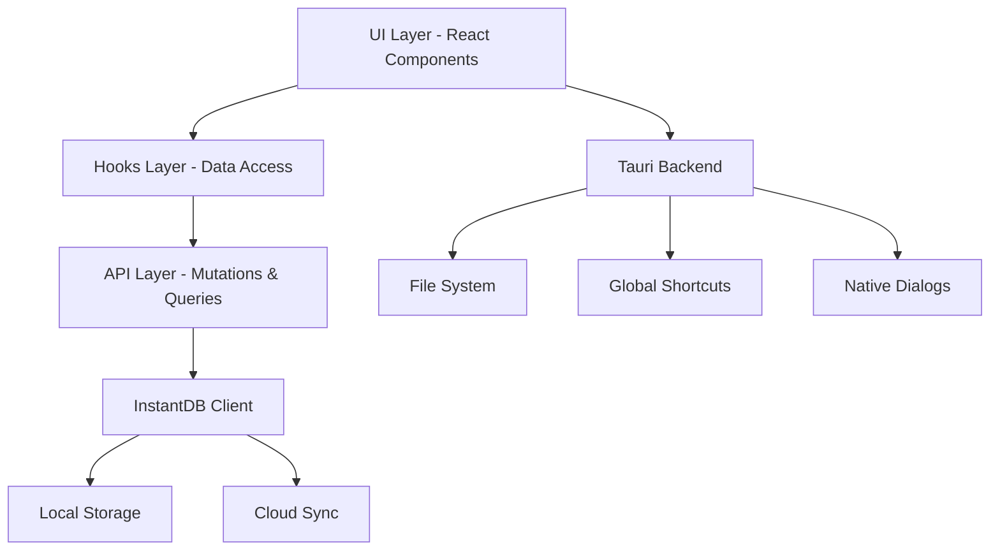

# Architecture

Skriuw follows a modular, layered architecture designed for maintainability, type safety, and developer experience.

## High-Level Overview



## Directory Structure

```
apps/instantdb/
├── src/
│   ├── api/                    # InstantDB configuration
│   │   └── db/
│   │       ├── client.ts       # DB initialization
│   │       └── schema.ts       # Type-safe schema
│   │
│   ├── modules/                # Feature modules
│   │   ├── notes/
│   │   │   └── api/
│   │   │       ├── queries/    # Data fetching
│   │   │       └── mutations/  # Data modifications
│   │   ├── tasks/
│   │   ├── folders/
│   │   ├── projects/
│   │   ├── shortcuts/
│   │   └── settings/
│   │
│   ├── hooks/                  # React hooks
│   │   └── core/              # Core hook utilities
│   │       ├── create-query-hook.ts
│   │       ├── use-mutation.ts
│   │       ├── use-create.ts
│   │       ├── use-update.ts
│   │       └── use-destroy.ts
│   │
│   ├── components/            # React components
│   │   ├── editor/           # Note editor
│   │   ├── file-tree/        # Sidebar navigation
│   │   ├── tasks/            # Task UI
│   │   ├── settings/         # Settings dialogs
│   │   └── ui/               # Reusable UI components
│   │
│   ├── views/                # Page-level components
│   │   ├── notes-view.tsx
│   │   └── tasks-view.tsx
│   │
│   ├── shared/               # Shared utilities
│   │   ├── components/       # Generic components
│   │   └── utilities/        # Helper functions
│   │
│   ├── types/                # TypeScript definitions
│   │   ├── index.ts
│   │   └── semantics.ts
│   │
│   ├── app/                  # Next.js App Router
│   │   ├── layout.tsx
│   │   ├── page.tsx
│   │   └── api/             # API routes
│   │
│   └── _seeding/            # Development seeding (dev-only)
│
├── src-tauri/               # Rust backend
│   ├── src/
│   │   ├── main.rs
│   │   └── lib.rs
│   ├── Cargo.toml
│   └── tauri.conf.json
│
└── public/                  # Static assets
```

## Core Architectural Patterns

### 1. Module-Based Organization

Each feature is self-contained in its own module:

```
modules/notes/
├── api/
│   ├── queries/
│   │   ├── get-notes.ts
│   │   └── get-note.ts
│   └── mutations/
│       ├── create.ts
│       ├── update.ts
│       ├── destroy.ts
│       ├── pin.ts
│       ├── move.ts
│       └── duplicate.ts
└── (components - optional)
```

**Benefits:**
- Clear boundaries between features
- Easy to locate related code
- Simplified testing and refactoring
- Natural code splitting points

### 2. Query/Mutation Pattern

All data operations follow a consistent pattern:

#### Queries (Read Operations)

```typescript
// modules/notes/api/queries/get-notes.ts
import { createQueryHook } from '@/hooks/core';

const useNotesQuery = createQueryHook(
  () => ({
    notes: {
      $: { order: { createdAt: 'desc' } },
      tasks: {},
      folder: {},
    },
  }),
  {
    select: (raw) => (raw?.notes as Note[]) ?? [],
    initialData: [] as Note[],
    showErrorToast: false,
  }
);

export function useGetNotes() {
  const { data, isLoading, error } = useNotesQuery();
  return { notes: data, isLoading, error };
}
```

#### Mutations (Write Operations)

```typescript
// modules/notes/api/mutations/create.ts
import { useCreate, useMutation } from '@/hooks/core';
import { generateId } from 'utils';

export function useCreateNote() {
  const { create } = useCreate('notes');
  const { mutate, isLoading, error } = useMutation(async (input: Props) => {
    const id = generateId();
    const now = Date.now();
    await create(id, { ...input, createdAt: now, updatedAt: now });
    return { id, ...input };
  });

  return { createNote: mutate, isLoading, error };
}
```

### 3. Core Hooks System

The `hooks/core` directory provides foundational abstractions:

#### `createQueryHook`
Creates type-safe query hooks with:
- Loading states
- Error handling
- Data transformation (`select`)
- Conditional queries (`enabled`)
- Initial/fallback data

#### `useMutation`
Wraps async operations with:
- Loading indicators
- Error handling and toast notifications
- Success/error callbacks
- Automatic error recovery

#### `useCreate`, `useUpdate`, `useDestroy`
Entity-specific CRUD operations that:
- Generate IDs
- Add timestamps
- Handle InstantDB transactions
- Provide consistent API

### 4. InstantDB Schema & Client

#### Schema Definition

```typescript
// api/db/schema.ts
import { i } from '@instantdb/react';

export const schema = i.graph({
  notes: i.entity({
    title: i.string(),
    content: i.string(),
    position: i.number(),
    pinned: i.boolean().optional(),
    createdAt: i.number().indexed(),
    updatedAt: i.number(),
  }),
  tasks: i.entity({
    content: i.string(),
    completed: i.boolean(),
    status: i.string(),
    position: i.number().indexed(),
    createdAt: i.number().indexed(),
    priority: i.string(),
    dueAt: i.number().optional(),
    tags: i.string().optional(),
    recurrence: i.string().optional(),
  }),
  // ... more entities
}, {
  // Relations
  noteFolders: {
    forward: { on: 'notes', has: 'one', label: 'folder' },
    reverse: { on: 'folders', has: 'many', label: 'notes' },
  },
  // ... more relations
});
```

#### Client Initialization

```typescript
// api/db/client.ts
import { init } from '@instantdb/react';
import { schema, type Schema } from './schema';

const APP_ID = process.env.NEXT_PUBLIC_INSTANT_APP_ID!;

export const db = init<Schema>({
  appId: APP_ID,
  schema,
});

export const { transact, useQuery, useAuth, tx } = db;
```

### 5. Tauri Integration

The Rust backend handles platform-specific features:

```rust
// src-tauri/src/lib.rs
#[cfg_attr(mobile, tauri::mobile_entry_point)]
pub fn run() {
    tauri::Builder::default()
        .plugin(tauri_plugin_store::Builder::new().build())
        .plugin(tauri_plugin_dialog::init())
        .plugin(tauri_plugin_fs::init())
        .setup(|app| {
            // Development logging
            if cfg!(debug_assertions) {
                app.handle().plugin(
                    tauri_plugin_log::Builder::default()
                        .level(log::LevelFilter::Info)
                        .build(),
                )?;
            }
            Ok(())
        })
        .run(tauri::generate_context!())
        .expect("error while running tauri application");
}
```

**Tauri Plugins Used:**
- **tauri-plugin-store**: Persistent key-value storage
- **tauri-plugin-dialog**: Native file/folder dialogs
- **tauri-plugin-fs**: File system access
- **tauri-plugin-global-shortcut**: System-wide keyboard shortcuts
- **tauri-plugin-log**: Logging for diagnostics

### 6. Component Hierarchy

```
App (layout.tsx)
├── Providers (context wrappers)
│   ├── ThemeProvider
│   ├── ToastProvider
│   ├── TooltipProvider
│   └── ShortcutProvider
│
├── Header (top-bar)
├── Navigation (sidebar)
│   ├── FileTree
│   │   ├── FolderItem
│   │   └── FileItem
│   └── Toolbar
│
└── Page Content
    ├── NotesView
    │   ├── NoteEditor (TipTap)
    │   └── TabsSystem
    │
    └── TasksView
        ├── TaskList
        └── TaskSidebar
```

## Data Flow

### Read Flow (Query)

```
1. Component renders
    ↓
2. useGetNotes() hook called
    ↓
3. createQueryHook executes query
    ↓
4. InstantDB fetches from local cache
    ↓
5. If stale, syncs from cloud
    ↓
6. Data transformed via `select`
    ↓
7. Component receives typed data
```

### Write Flow (Mutation)

```
1. User action triggers mutation
    ↓
2. useCreateNote() called with data
    ↓
3. useMutation wraps async operation
    ↓
4. ID generated, timestamps added
    ↓
5. InstantDB transact() called
    ↓
6. Optimistic update applied locally
    ↓
7. UI updates immediately
    ↓
8. Background sync to cloud
    ↓
9. Conflicts resolved automatically
```

## Type Safety

### Schema Types

InstantDB generates types from the schema:

```typescript
import type { Schema } from '@/api/db/schema';

type Note = Schema['notes'];
type Task = Schema['tasks'];
```

### Query Types

Hooks return fully typed data:

```typescript
const { notes, isLoading, error } = useGetNotes();
//      ^? Note[]

notes.forEach(note => {
  console.log(note.title);    // ✓ Type-safe
  console.log(note.invalid);  // ✗ TypeScript error
});
```

## Error Handling

### Centralized Error Handler

```typescript
// hooks/use-error-handler.ts
export function useErrorHandler({ showToast = true }) {
  const handleError = (error: Error, context?: string) => {
    console.error(`[${context}]:`, error);
    
    if (showToast) {
      toast({
        title: 'Error',
        description: error.message,
        variant: 'destructive',
      });
    }
  };
  
  return { handleError };
}
```

All queries and mutations automatically use this for consistent error reporting.

## Performance Optimizations

### 1. Optimistic Updates
InstantDB applies changes locally before server confirmation.

### 2. Indexed Queries
Frequently queried fields are indexed in the schema:

```typescript
createdAt: i.number().indexed(),
position: i.number().indexed(),
```

### 3. Lazy Loading
Components load on-demand using Next.js dynamic imports:

```typescript
const SettingsDialog = dynamic(() => import('./settings-dialog'));
```

### 4. Memoization
Expensive computations are memoized:

```typescript
const sortedNotes = useMemo(
  () => notes.sort((a, b) => a.position - b.position),
  [notes]
);
```

## Security Considerations

### Environment Variables
Sensitive keys are never committed:

```bash
# .env (gitignored)
NEXT_PUBLIC_INSTANT_APP_ID=your-app-id
```

### Tauri Security
- CSP (Content Security Policy) configured in `tauri.conf.json`
- IPC calls validated and type-checked
- File system access scoped to app directories

## Next Steps

<Cards>
  <Card title="Tech Stack Details" href="/docs/app/tech-stack">
    Learn about each technology in depth
  </Card>
  <Card title="Development Guide" href="/docs/app/development">
    Start building features
  </Card>
  <Card title="API Reference" href="/docs/app/api-reference">
    Explore available hooks and utilities
  </Card>
</Cards>

