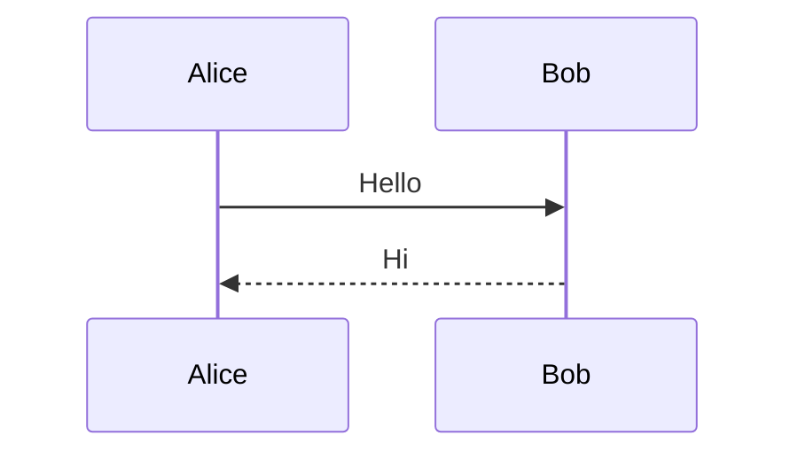
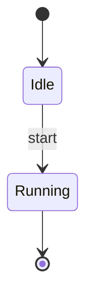
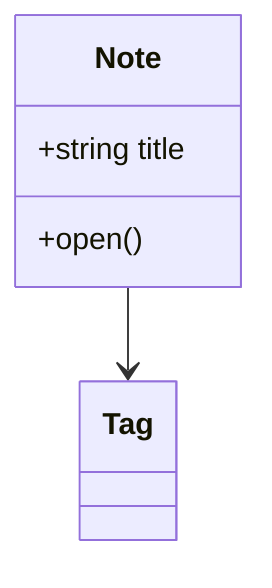
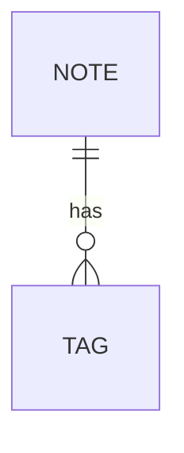

Skriuw lets you add diagrams directly inside your notes using **Mermaid** - a popular diagramming language that turns text into visuals.

<Media label="Mermaid diagram in a note" caption="Typing a diagram block and watching it render live." />

## How it works

Type ` ```mermaid ` (or ` ```diagram `) in the editor to insert a diagram block. Write your diagram code inside, and Skriuw renders it as a clean visual right there in your note.

## What you can draw

- **Flowcharts** - step-by-step processes, decision trees, workflows
- **Sequence diagrams** - interactions between people, systems, or services
- **Class diagrams** - entity relationships, data models
- **Gantt charts** - project timelines, task schedules
- **Mind maps** - brainstorming and idea mapping
- **Git graphs** - branch and commit histories
- **Pie charts, timelines, and more**

## Sequence, state, class, and ER diagrams

In the desktop app, `mermaid` fences that are not flowcharts render as a
read-only preview inside the code block. Type `/sequence`, `/state`, `/class`,
or `/er` to insert a starter, or paste any Mermaid source into a `mermaid` code
block.









- **Source** and **Preview** in the block toolbar switch between the code and
  the rendered diagram. Press Enter on a selected preview to edit, Escape to go
  back, or `Ctrl/Cmd+Alt+P` from anywhere in the block.
- **Expand** opens the diagram full-screen; pinch or scroll to zoom and pan.
- Wide diagrams scroll sideways inside the block instead of shrinking.
- A syntax error shows its message under the preview and keeps the last good
  rendering.
- Diagrams follow your theme.

Supported for rendering: flowcharts, sequence, state, class, and ER diagrams.
Other Mermaid families such as Gantt charts, pie charts, mind maps, and Git
graphs stay as plain source with a short note.

## Editing diagrams

- Click the rendered diagram to edit its source code
- The diagram updates live as you type
- Switch to **dark theme** for the diagram if your note uses a dark background
- If something is wrong in your code, Skriuw shows the error inline so you can fix it

## Copying diagrams

Each diagram block has a **copy source** button - one click copies the raw Mermaid code to your clipboard so you can paste it elsewhere.

## Why use diagrams in notes?

Diagrams turn abstract ideas into something you can see and reason about. Instead of describing a process in paragraphs, you draw it. Instead of keeping project timelines in a separate tool, you embed them next to your notes. Everything stays connected in one place.
