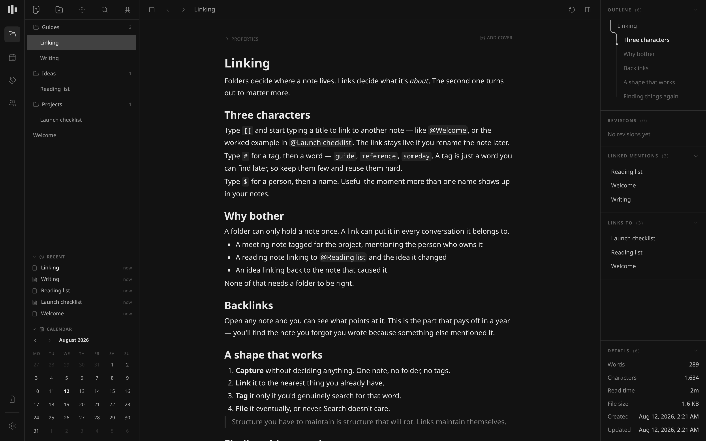

<p align="center">
  
</p>

<h1 align="center">Skriuw</h1>

<p align="center">
  <em><strong>skriuw</strong> · Frisian · "to write"</em>
</p>

<p align="center">
  A fast, private writing workspace for notes, journals, and connected knowledge.
</p>

<p align="center">
  <a href="https://github.com/remcostoeten/skriuw/releases/latest"></a>
  <a href="https://github.com/remcostoeten/skriuw/actions/workflows/ci-v2.yml"></a>
  <a href="../LICENSE"></a>
  <a href="https://github.com/remcostoeten/skriuw/releases"></a>
</p>



Your workspace is a SQLite database on your machine. Open the app, type, and
every keystroke paints in the same frame — no spinners, no server round-trips,
no account. Try it without installing anything: the **full app runs in your
browser** at [skriuw.com/app](https://skriuw.com/app).

- Rich-text editor with Markdown input rules and paste, tables, checklists, toggles, code blocks, slash commands, find/replace, note properties, images, and Mermaid-round-tripping flowcharts
- `#` tags, `$` people, and `[[` wiki-links stored by ID, so renames propagate; backlinks on every note, tag, and person
- Nested note tree (virtualized, fast at 5,000+ nodes), pinned notes, tabs, split view, drag and drop, trash with subtree restore
- Daily journal with mood tracking, calendar, and streaks
- Automatic background Git history with in-app restore, verified backups every six hours, JSON workspace archives
- Importers for Markdown, Obsidian, Notion, Bear, Simplenote, and Apple Notes
- Full keyboard control throughout
- Optional cloud sync, off by default

The complete feature reference is in [FEATURES.md](FEATURES.md).

## What makes it different

Most "local-first" apps are a web client with a cache. Skriuw is one Rust
core — schema, operations, search, history — behind narrow ports, with an
adapter per platform:

- On desktop it links against native SQLite inside a Tauri shell.
- In the browser **the same core is compiled to WebAssembly** and owns a real
  SQLite database in OPFS inside a worker. [skriuw.com/app](https://skriuw.com/app)
  is the entire application, not a demo or a thin client.
- Every action updates renderer state synchronously and paints in the same
  frame; durability happens on a serialized queue the UI never waits for.
- Git history, verified backups, and sync consume durable outboxes on
  background threads — they can fail, retry, and recover without ever
  blocking typing or navigation.
- Sync, when you turn it on, replicates versioned operations — never database
  files — through an ordered per-workspace log. Concurrent edits become
  explicit both-version conflicts, never silent merges.

[ARCHITECTURE.md](ARCHITECTURE.md) has the full system shape; decisions live
in [docs/adr](docs/adr).

## Installation

The [latest GitHub release](https://github.com/remcostoeten/skriuw/releases/latest)
has installers for macOS, Windows, and Linux (`.dmg`, `.exe`/`.msi`, `.deb`,
`.rpm`, AppImage).

### Debian / Ubuntu (APT)

```bash
curl -fsSL https://remcostoeten.github.io/skriuw/apt/key.gpg \
  | sudo gpg --dearmor -o /usr/share/keyrings/skriuw.gpg
echo "deb [signed-by=/usr/share/keyrings/skriuw.gpg] https://remcostoeten.github.io/skriuw/apt stable main" \
  | sudo tee /etc/apt/sources.list.d/skriuw.list
sudo apt update && sudo apt install skriuw
```

### Fedora / RHEL / openSUSE (dnf)

```bash
sudo dnf config-manager addrepo --from-repofile=https://remcostoeten.github.io/skriuw/rpm/skriuw.repo
sudo dnf install skriuw
```

### macOS (Homebrew)

```bash
brew tap remcostoeten/skriuw https://github.com/remcostoeten/skriuw
brew install --cask skriuw
```

### Windows (Scoop)

```powershell
scoop bucket add skriuw https://github.com/remcostoeten/skriuw
scoop install skriuw
```

### Arch Linux (AUR)

```bash
yay -S skriuw-bin
```

AUR publication is currently paused upstream, so that package can lag behind
the latest release. Winget and Snap are wired into release automation but
have no current publication; use a release asset or one of the channels above.

## Privacy

A fresh install performs no network requests. Notes, images, search indexes,
history, and backups are local files, and there is no analytics, crash
reporting, or telemetry of any kind — the only network code in the app is the
opt-in sync Worker and the updater's version check. With sync enabled, data
is encrypted in transit; end-to-end encryption is an open decision
([details](docs/specs/cloud-sync-master.md)), so if that boundary matters to
you, stay local-only.

## Development

Rust 1.95, Bun 1.3, Node.js 24, and the platform dependencies required by
Tauri.

```bash
./scripts/bootstrap.sh   # one-time setup
./scripts/check.sh       # full gate: contracts, lint, all tests
./scripts/build.sh       # build (also: web | desktop | ci)
```

The repository layout, web deployment, and cloud development reference is in
[docs/development.md](docs/development.md). Contributions start at
[CONTRIBUTING.md](../CONTRIBUTING.md); report security issues through
[SECURITY.md](../SECURITY.md) instead of a public issue.

The previous generation of Skriuw (web, mobile, collaboration, self-hosting)
lives in [`apps/`](../apps) and [`packages/`](../packages) and is frozen; see
the [repository README](../README.md).

## License

[MIT](../LICENSE)
